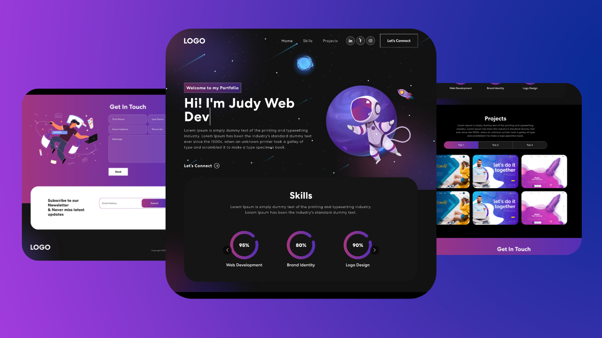

# Ouma² Portfolio 🚀

A modern, responsive portfolio website built with Next.js, showcasing my professional journey and technical expertise. Visit the live site at [ouma-portfolio-g46m.vercel.app](https://ouma-portfolio-g46m.vercel.app/)



## ✨ Features

- **Responsive Design**: Fully optimized for all devices (mobile, tablet, desktop)
- **Modern UI/UX**: Clean interface with smooth animations using Framer Motion
- **Dark Theme**: Eye-friendly dark mode design
- **Interactive Components**: 
  - Dynamic project filtering
  - Animated number counters
  - Typing animations
  - Contact form with email integration
- **Performance Optimized**: Fast loading times and optimized assets
- **SEO Ready**: Meta tags and optimized structure for better search engine visibility

## 🛠️ Tech Stack

- **Framework**: [Next.js 15.0](https://nextjs.org/)
- **Styling**: [Tailwind CSS](https://tailwindcss.com/)
- **Animations**: [Framer Motion](https://www.framer.com/motion/)
- **Email Service**: [Resend](https://resend.com/)
- **Icons**: 
  - [Hero Icons](https://heroicons.com/)
  - [React Icons](https://react-icons.github.io/react-icons/)
- **Deployment**: [Vercel](https://vercel.com/)

## 📂 Project Structure

```plaintext
├── public/          # Static assets
├── src/
│   ├── app/        # Next.js app directory
│   │   ├── api/    # API routes
│   │   ├── components/  # React components
│   │   └── layout.js   # Root layout
│   └── styles/     # Global styles
├── tailwind.config.js  # Tailwind configuration
└── package.json    # Project dependencies
```

## 🚀 Getting Started

### Prerequisites

- Node.js >= 20.18.0
- npm or yarn
- Git

### Installation

1. Clone the repository
```bash
git clone https://github.com/garveyshah/ouma-portfolio
cd ouma-portfolio
```

2. Install dependencies
```bash
npm install
# or
yarn install
```

3. Create a `.env` file in the root directory:
```env
RESEND_API_KEY=your_resend_api_key
FROM_EMAIL=your_email@domain.com
```

4. Start the development server
```bash
npm run dev
# or
yarn dev
```

5. Open [http://localhost:3000](http://localhost:3000)

## 🛠️ Development

### Available Scripts

- `npm run dev` - Start development server
- `npm run build` - Build for production
- `npm start` - Start production server
- `npm run lint` - Run ESLint

### Environment Variables

Required environment variables:

- `RESEND_API_KEY` - API key for email service
- `FROM_EMAIL` - Sender email address

## 📱 Features Showcase

- **Dynamic Project Filtering**: Filter projects by technology
- **Animated Sections**: Smooth scroll animations
- **Contact Form**: Direct email integration
- **Social Links**: Easy access to social profiles
- **Responsive Navigation**: Mobile-friendly menu

## 🤝 Contributing

Contributions are welcome! Please feel free to submit a Pull Request.

1. Fork the repository
2. Create your feature branch (`git checkout -b feature/AmazingFeature`)
3. Commit your changes (`git commit -m 'Add some AmazingFeature'`)
4. Push to the branch (`git push origin feature/AmazingFeature`)
5. Open a Pull Request

## 📝 License

This project is licensed under the MIT License - see the [LICENSE](LICENSE) file for details.

## 📬 Contact

Ouma Godwin - [@ouma_godwin1](https://twitter.com/ouma_godwin1)

Email: [ouma.godwin10@gmail.com](mailto:ouma.godwin10@gmail.com)

Project Link: [https://github.com/garveyshah/ouma-portfolio](https://github.com/garveyshah/ouma-portfolio)

## 🙏 Acknowledgments

- [Next.js Documentation](https://nextjs.org/docs)
- [Tailwind CSS](https://tailwindcss.com/)
- [Framer Motion](https://www.framer.com/motion/)
- [Vercel](https://vercel.com/)
